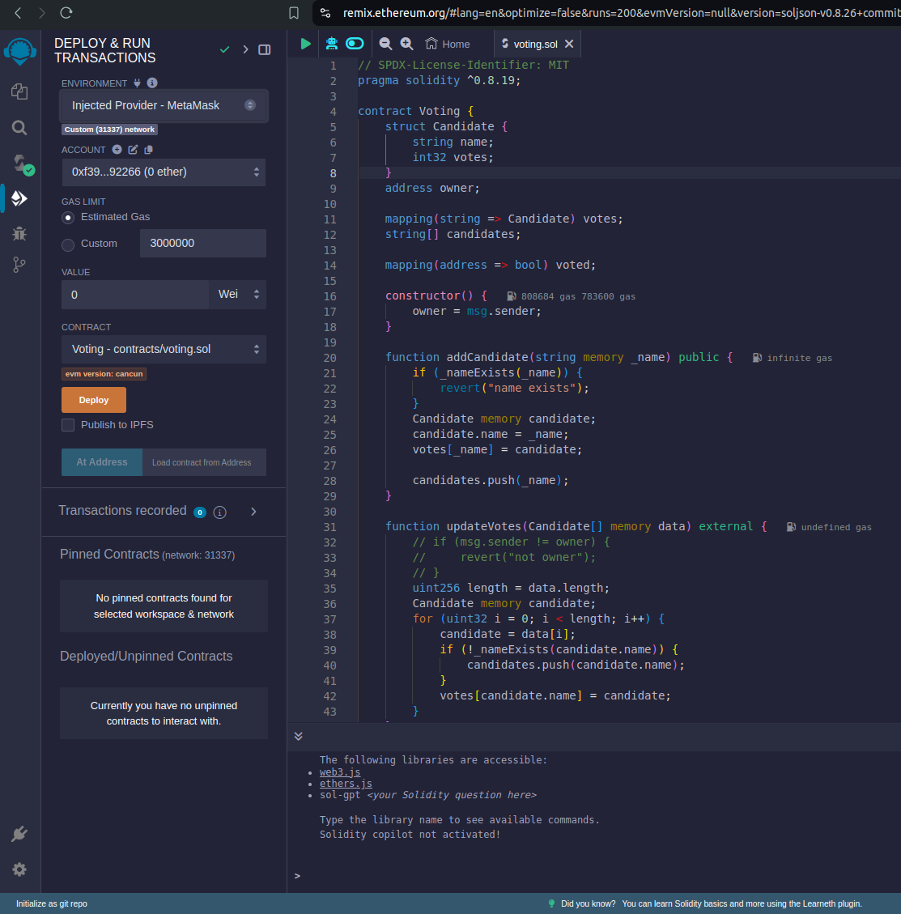

# Cartesi Voting DApp

Voting Cartesi DApp is used to curate votes for candidates that have been registered. It utilizes cartesi and synchronizes it's candidates and votes with a smart contract deployed on an EVM compatible chain.

This Dapp is built to work with the cartesi. To test application locally, you need the cartesi cli installed.

## Prerequisites

Here are some packages you need to have installed on your PC:

* [nodejs](https://nodejs.org/en), [npm](https://docs.npmjs.com/cli/v10/configuring-npm/install), [yarn](https://classic.yarnpkg.com/lang/en/docs/install/#debian-stable)

* [docker](https://docs.docker.com/get-docker/)

* [cartesi-cli](https://docs.cartesi.io/cartesi-rollups/1.3/development/migration/#install-cartesi-cli)

  ```sh
  npm install -g @cartesi/cli
  ```

## Installation

* Clone the github repository and change into the directory

```bash
git clone https://github.com/BenFaruna/cartesi-voting-dapp.git
cd cartesi-voting-dapp
```

* Install NPM packages

```sh
yarn  install
```

* Build and run the dapp via `cartesi-cli`

```sh
cartesi build 
```

and

```sh
cartesi run --epoch-length=1
```

NB: `epoch-length` reduces the amount of time it takes request to the base layer to be reconciled.

* Deploy [`./src/voting.sol`](./src/voting.sol) using [remix](https://remix.ethereum.org/) and an injected provider.


## Usage

Here you can access the examples of dapp communication and resources consume.

There are these resources available on this dapp:

### Advance handlers

* set_address

```json
description - sets the address of the deployed smart contract for interaction.
param - {"method":"set_address", "address": "0x..."}

address: smart contract address
```

Interact via `cartesi-cli`

```bash
cartesi send generic
? Chain Foundry
? RPC URL http://127.0.0.1:8545
? Wallet Mnemonic
? Mnemonic test test test test test test test test test test test junk
? Account 0xf39Fd6e51aad88F6F4ce6aB8827279cffFb92266 9993.475401862147957224 ETH

? Application address 0xab7528bb862fb57e8a2bcd567a2e929a0be56a5e
? Input String encoding
? Input (as string)
{"method":"set_address","address":"0x..."}
✔ Input sent: ...
```

* add_candidate

```json
description - adds candidate that can be voted
param - {"method":"add_candidate", "name": "...name string..."}
```

Interact via `cartesi-cli`

```bash
cartesi send generic
? Chain Foundry
? RPC URL http://127.0.0.1:8545
? Wallet Mnemonic
? Mnemonic test test test test test test test test test test test junk
? Account 0xf39Fd6e51aad88F6F4ce6aB8827279cffFb92266 9993.475401862147957224 ETH

? Application address 0xab7528bb862fb57e8a2bcd567a2e929a0be56a5e
? Input String encoding
? Input (as string)
{"method":"add_candidate","name":"Chi"}
✔ Input sent: ...
```

* vote

```json
description - votes for a name, each address gets one vote.
param - {"method":"vote", "name": "...name string..."}
```

Interact via `cartesi-cli`

```bash
cartesi send generic
? Chain Foundry
? RPC URL http://127.0.0.1:8545
? Wallet Mnemonic
? Mnemonic test test test test test test test test test test test junk
? Account 0xf39Fd6e51aad88F6F4ce6aB8827279cffFb92266 9993.475401862147957224 ETH

? Application address 0xab7528bb862fb57e8a2bcd567a2e929a0be56a5e
? Input String encoding
? Input (as string)
{"method":"vote","name":"Chi"}
✔ Input sent: ...
```

* synchronize_vote

```json
description -  synchronize records with the smart contract. It creates a voucher to be executed
param - {"method":"synchronize_vote"}
```

Interact via `cartesi-cli`

```bash
cartesi send generic
? Chain Foundry
? RPC URL http://127.0.0.1:8545
? Wallet Mnemonic
? Mnemonic test test test test test test test test test test test junk
? Account 0xf39Fd6e51aad88F6F4ce6aB8827279cffFb92266 9993.475401862147957224 ETH

? Application address 0xab7528bb862fb57e8a2bcd567a2e929a0be56a5e
? Input String encoding
? Input (as string)
{"method":"synchronize_vote"}
✔ Input sent: ...
```

### Inspect handlers

* get_votes

```doc
description — get all votes.
```

returned hex sample

```json
{
    "status": "Accepted",
    "exception_payload": null,
    "reports": [
        {
            "payload": "0x..."
        }
    ],
    "processed_input_count": 2
}
```

converted payload sample

```json
[
    {
        "name":"Chi",
        "votes":1
    },
    ...
]
```

interact

access the cartesi inspect endpoint on your browser
<http://localhost:8080/inspect/get_votes>

* get_vote

```doc
  description — get vote for a candidate.
  param name - candidate name
```

returned hex sample

```json
{
    "status": "Accepted",
    "exception_payload": null,
    "reports": [
        {
            "payload": "0x..."
        }
    ],
    "processed_input_count": 2
}
```

converted payload sample

```json
{
    "name": "Chi",
    "votes": 1
}
```

interact

access the cartesi inspect endpoint on your browser
<http://localhost:8080/inspect/get_vote/Chi>
